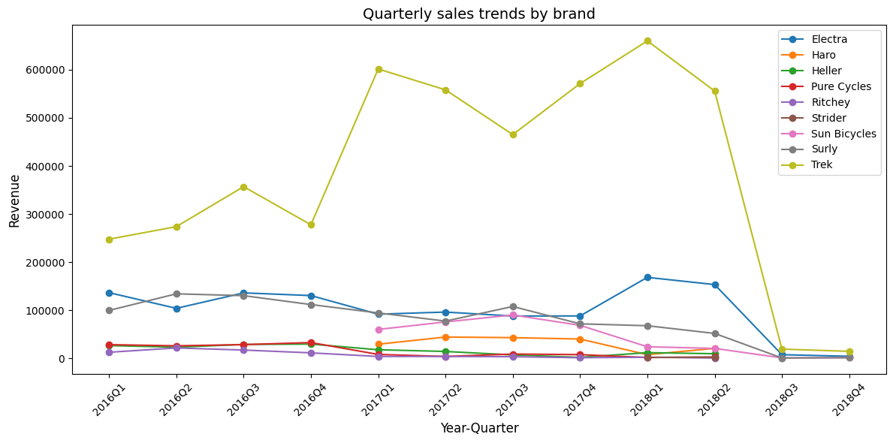

# Bike Store Data Analysis

## 📌 개요
- Oracle DB를 활용한 Bike Store 데이터 분석
- SQL 스크립트와 Python(Jupyter Notebook)을 사용하여 EDA, 가설 검증, 시각화를 수행
- GitHub 저장소에 데이터 처리 단계별 SQL과 분석 노트북을 정리

## 📂 파일 구조
- `1. SYS.sql` : 데이터베이스 사용자 및 권한, 디렉토리 설정
- `2. ETL.sql` : CSV 파일을 외부 테이블로 불러와 데이터 적재
- `3. DDL.sql` : 스키마 정의 (테이블, 관계)
- `4. EDA.sql` : 탐색적 데이터 분석 (EDA) 쿼리 모음
- `5~8. HypothesisX.sql` : 가설별 분석 SQL
- `data_analysis.ipynb` : 주피터 노트북 환경에서의 데이터 분석 및 데이터 시각화 추가
- `data_modeling_analysis.txt` : 데이터 모델링 구조 분석 문서

## ⚙️ 실행 환경
- Oracle Database 21c XE
- SQL Developer
- Python 3.10.7  
  - pandas==2.2.2
  - matplotlib==3.9.1.post1
  - oracledb==3.3.0
 
## 🗂 데이터 모델링 ERD  

## 🚀 실행 방법
1. Oracle DB에 `1. SYS.sql` 실행 → 사용자 및 디렉토리 생성
2. `2. ETL.sql` 실행 → CSV 데이터 로드
3. `3. DDL.sql` 실행 → 스키마 생성
4. `4. EDA.sql` 실행 → EDA 결과 확인
5. `5~8. Hypothesis.sql` 실행 → 가설 검증
6. `data_analysis.ipynb` 실행 → 주피터 노트북 환경에서 데이터 분석 및 시각화

## 📊 주요 분석 주제
- 브랜드별 매출 분포
- 신규/기존 고객 매출 기여도
- 분기별 브랜드 매출 추이
- 카테고리 집중도 및 매장 편향성

## 📈 분석 결과 요약

- **브랜드별 매출 분포**

  - Trek: 전체 매출의 약 60% 차지 (압도적 1위)  
  - Electra: 약 16%, Surly: 약 12%  
  - 나머지 브랜드들은 한 자릿수 비중  

- **신규/기존 고객 기여도**

  - 신규 고객 매출 비중이 85% 이상  

- **분기별 브랜드 매출 추이**

  - Trek은 연중 안정적 매출 유지, 2017~2018 상승세 뚜렷.
  - Electra·Surly는 특정 분기 반짝 매출, 이후 급락.
  - Sun Bicycles는 2017년 Q3에 최고 매출, 이후 급감.  

- **카테고리 집중도**

  - Heller, Ritchey 등은 단일 카테고리에 100% 의존 → 변동성 큼  
  - Trek은 Mountain(40%), Road(35%), Electric(18%) 등 다변화 → 안정적 구조  

## 📌 인사이트
- **고객 유지 전략** 필요: 신규 고객 의존도가 크므로 멤버십/리텐션 강화가 필요  
- **매출 분산 전략** 필요: 특정 매장/카테고리에 집중된 매출 구조를 개선해야 안정성 확보 가능  
- **브랜드별 전략 차별화**: Electra는 충성 고객 중심, Trek은 신규 고객 확대 전략이 효과적

## 🗂 데이터 출처

데이터는 Kaggle의 Bike Store Sample Database에서 가져왔습니다.
- https://www.kaggle.com/datasets/dillonmyrick/bike-store-sample-database/data

